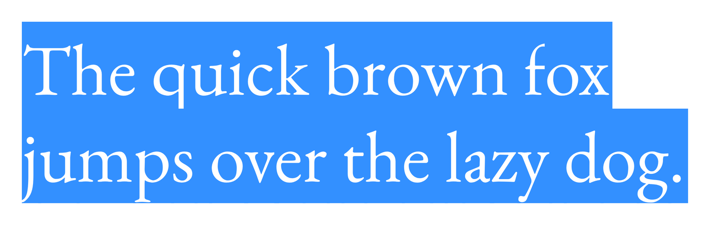

# Select All

A color font based on EB Garamond where every glyph appears permanently text-selected. White letterforms on blue highlight rectangles.

## Download

**[Download Select All 1.200](https://github.com/michaelsfonts/Select-All/releases/latest)**: TTF to install on your computer, WOFF2 for the web, or the zip with both.

The same files are in [`fonts/`](fonts/) if you would rather browse the repo.

## Details

- Released Mar 11, 2026
- 1 style
- TTF, WOFF2
- Desktop and web use
- SIL Open Font License 1.1
- Copyright 2024 The EB Garamond Project Authors, modified by Michael Seh

---

Part of [Michael's Fonts](https://michaelsfonts.com). This repository is archived:
the font is finished and is kept here for reference.